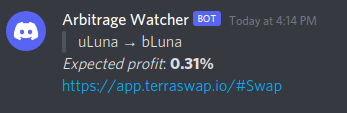

# Arbitrage Watcher

<p>
  
  <a href="https://raw.githubusercontent.com/imalic3/arbitrage_watcher/master/LICENSE" target="_blank">
    
  </a>
</p>

This project aims to prove the concept of a arbitrage watcher that migrate to webhook (eg. Discord).

## Prerequisite

- Docker
- build-essential

## Configuration

Users can configure the watcher through the environment file (.env).

- ~~`EXPECTED_PROFIT` is the expected profit threshold. Setting this value to 5.00, the watcher will trigger if the arbitrage profit goes up to 5%, 10%, 15%, and so on.~~ (deprecated; use expectedProfile in Swap class instead)
- `WATCHING_INTERVAL` is the interval time (in minutes) that the watcher tries to query the price on-chain.
- `DISCORD_WEBHOOK` can be obtained on Discord, by go to _Text-Channels_ > _Edit-Channel_ > _Integrations_ > _Webhooks_.

## Usage

```
make all
```

## Example output

This is an example output on Discord.



## Future work

This is the first version that supports only LUNA/bLUNA pair on TerraSwap. In the future, we need to support several DEXes and Token Pairs as much as possible.

- [x] LUNA/bLUNA
- [ ] LUNA/UST

## License

Copyright © 2021 imalic3.
This project is Unlicense licensed.
